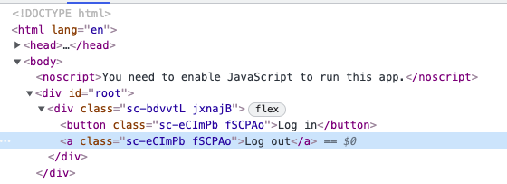
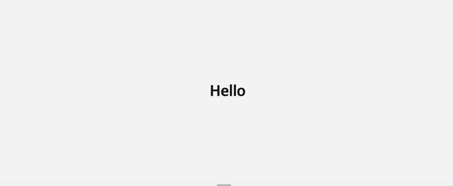

# styled-components 사용 방법 
- 기존에 react js 에서 스타일을 입히는 방법은 약 3가지: 
  - 1. 인라인으로 자바스크립트 코드를 직접 입력하는 방법 
  - 2. global 하게 모든 파일에 `styles.css` 파일을 적용 시키는 방법 
  - 3. `___.module.css` 파일을 만드는 방법 
- 위에 제시된 각각의 방식은 단점이 있었다: 
  - 1. 자바스크립트 코드로 스타일을 작성해야 한다       
    (e.g. <div style={{backgroundColor}}></div>)
  - 2. global하게 모든 곳에 적용되는 스타일링이다 
  - 3. `import styles from "./___.module.css"`를 스타일링이 적용되는 파일에 가서 해줘야만 하는 번거로움과        
    스타일링을 적용할 태그마다 e.g. <div className={styles.모듈css파일에적힌클래스명}></div> 식으로 `className`을 반드시 적어줘야 한다는 번거로움이 있다.      
- 그래서 ... `styled-components` 라이브러리를 사용하는 이유? 
  - 위에서 제시된 단점 보완 가능 
  - 및 기타 [장점](https://analogcoding.tistory.com/181
  https://kyounghwan01.github.io/blog/React/styled-components/
  https://gold-dragon.tistory.com/228)들이 있음!

  <!-- https://analogcoding.tistory.com/181
  https://kyounghwan01.github.io/blog/React/styled-components/
  https://gold-dragon.tistory.com/228 -->

<br />

> 기본 사용방법: 
- 우선 terminal에서 `$ npm i styled-components`라는 npm 커맨드로 관련 npm 패키지 설치.     
그리고 ...       

  ```js
    import styled from "styled-components";


    const TestComponent = styled.div`
      // 그냥 css 코드 작성하듯 자유롭게 작성
    `;

    function App() {
      return (
        <TestComponent>
          This is for a test...
        </TestComponent>
      );
    }

    export default App;
  ```

<br />

> "props" 받아오는 방법:  
  ```js
    import styled from "styled-components";

    const Box1 = styled.div`
      background-color: tomato;  
      width: 100px;
      height: 100px;
    `;
    const Box2 = styled.div`
      background-color: teal;  
      width: 100px;
      height: 100px;
    `;

    // props 받아오기
    const BoxCommon = styled.div`
      background-color: ${(props) => props.bgColor};  
      width: 100px;
      height: 100px;
    `;


    function App() {
      return (
        <Box1 />
        <Box2 />

        <BoxCommon bgColor="tomato" />
        <BoxCommon bgColor="teal" />
      );
    }

    export default App;
  ```

<br />

> "확장" 하는 방법: 
  ```js
    import styled from "styled-components";

    const Box = styled.div`
      background-color: ${(props) => props.bgColor};  
      width: 100px;
      height: 100px;
    `;

    const Circle = styled.div`
      background-color: ${(props) => props.bgColor};
      width: 100px;
      height: 100px;
      border-radius: 50px;   
    `;

    // 위에서 Box와 Circle이 다른것은 border-radius: 50px; 하나밖에 없다 
    // TIP! styled-components를 "확장"해서 사용할 것!

    const CircleExtended = styled(Box)`
      border-radius: 50px;
    `;
    // 이렇게 Box가 갖고있는 모든 속성을 가져오지만, 동시에 다른 코드를 추가할 수 있게 한다!

    function App() {
      return (
        <CircleExtended bgColor="pink" />
        <CircleExtended bgColor="violet">
          violet colored circle
        </CircleExtended>
        <CircleExtended bgColor="red" />
      );
    }
    
    export default App;
  ```

<br />

> "as" attribute 사용 방법:          
(cf. 다른 태그로 바꾸고는 싶지만 스타일은 그대로 가져가고 싶을 때 사용)       
  ```js
    import styled from "styled-components";

    const TestComponent = styled.div`
      display: flex;
    `;

    const Btn = styled.button`
      color: white;
      background-color: tomato;
      border: 0;
      border-radius: 15px;
    `;

    function App() {
      return (
        <TestComponent>
          <Btn>log in</Btn>
          <Btn as="a">log out</Btn>
        </TestComponent>
      );
    }

    export default App;
  ```       
  결과:       
  

<br />

> styled-components로 attribute 설정하는 방법:      
  ```js
    import styled from "styled-components";

    // const Input = styled.input`
    //   background-color: tomato;
    // `;        

    // styled-components로 attribute 설정하는 방법
    const Input = styled.input.attrs({ required: true, })`
      background-color: tomato;
    `;

    function App() {
      return (
     {/* <Input required />
      <Input required />
      <Input required />
      <Input required />
      <Input required />    대신에 ... */}

      <Input />
      <Input />
      <Input />
      <Input />
      <Input />
      );
    }

    export default App;
  ```            
  결과:                   
  

<br />

> styled-components 안에서 animation을 주는 방법:      
  ```js
    // keyframes 이라는 helper funciton 을 import한다
    import styled, { keyframes } from "styled-components";

    // animation 만들기 
    const rotateAnimation = keyframes`
      from {
        transform: rotate(0deg);
      } to {
        transform: rotate(360deg);
      }
    `;

    const Wrapper = styled.div`
      display: flex;
    `;

    const Box = styled.div`
      height:200px;
      width: 200px;
      background-color: tomato;
      animation: ${rotateAnimation} 3s linear infinite;
    `;

    function App() {
      return (
        <Wrapper>
          <Box />
        </Wrapper>
      );
    }

    export default App;
  ```

<br />

> styled-components 안에서 pseudo selectors를 사용하는 방법:      
  ```js
    // styled-components안에 다른 태그를 포함시킬 수 있다
    import styled, { keyframes } from "styled-components";

    // animation 만들기 
    const rotateAnimation = keyframes`
      from {
        transform: rotate(0deg);
      } to {
        transform: rotate(360deg);
      }
    `;

    const Wrapper = styled.div`
      display: flex;
    `;

    const Box = styled.div`
      height:200px;
      width: 200px;
      background-color: tomato;
      display: flex;
      justify-content: center;
      align-items: center;
      animation: ${rotateAnimation} 3s linear infinite;

      span {
        font-size: 30px;

        /* pseudo selectors */  
        &:hover {
          font-size: 40px;
        }
        &: active {
          opacity: 0;
        }

      }
    `;

    function App() {
      return (
        <Wrapper>
          <Box>
          <span>😋</span>
          </Box>
        </Wrapper>
      );
    }

    export default App;
  ```        
  응용:         
  HTML 태그가 바껴도 상관없이 스타일링이 적용된다는 장점!        
  ```js
    import styled, { keyframes } from "styled-components";

    // animation
    const rotateAnimation = keyframes`
      from {
        transform: rotate(0deg);
      } to {
        transform: rotate(360deg);
      }
    `;

    const Wrapper = styled.div`
      display: flex;
    `;

    const Emoji = styled.span`
      font-size: 30px;
    `;

    const Box = styled.div`
      height:200px;
      width: 200px;
      background-color: tomato;
      display: flex;
      justify-content: center;
      align-items: center;
      animation: ${rotateAnimation} 3s linear infinite;
      ${Emoji} {
        &:hover {
          font-size: 98px;
        }
        &:active {
          opacity: 0;
        }
      }
    `;

    function App() {
      return (
        <Wrapper>
          <Box>
          <Emoji as="p">😋</Emoji>
          </Box>
        </Wrapper>
      );
    }

    export default App;
  ```        

<br />

> styled-components의 themes를 사용하는 방법:      
  - `theme`이란? 
    - 기본적으로 모든 색상들을 가지고 있는 object를 의미한다. 
    - 그리고 모든 색깔을 하나의 object 안에 넣어놨기 때문에 매우 유용하게 사용이 가능하다. 왜냐면 나중에 색깔을 바꿀 때 그냥 해당 object만 바꿔주면 되고, component의 색을 일일이 바꾸지 않아도 되기 때문이다.
  - 사용 방법:     
    - `import { ThemeProvider } from 'styled-components';`
    - `<App />`을 `<ThemeProvider></ThemeProvider>`로 감싼다 
    - `<ThemeProvider theme={}><ThemeProvider>`
    - e.g. `const darkTheme = {textColor: "whitesmoke",backgroundColor: "#111"};`
    - `<ThemeProvider theme={darkTheme}><ThemeProvider>`
    - 이런 식으로 작동... 
  ```js 
    // index.js

    import React from 'react';
    import ReactDOM from 'react-dom';
    import { ThemeProvider } from 'styled-components';
    import App from './App';

    const darkTheme = {
      textColor: "whitesmoke",
      backgroundColor: "#111",
    };

    const lightTheme = {
      textColor: "#111",
      backgroundColor: "whitesmoke",
    };

    ReactDOM.render(
      <React.StrictMode>
        <ThemeProvider theme={darkTheme}>
          <App />
        </ThemeProvider>
      </React.StrictMode>,
      document.getElementById('root')
    );

  ```

  <br />

  ```js 
    // App.js
    import styled from "styled-components";

    const Title = styled.h1`
      color: ${(props) => props.theme.textColor};
    `;

    const Wrapper = styled.div`
      display: flex;
      height: 100vh;
      width: 100vw;
      justify-content: center;
      align-items: center;
      background-color: ${(props) => props.theme.backgroundColor};
    `;

    function App() {
      return (
        <Wrapper>
          <Title>Hello</Title>
        </Wrapper>
      );
    }

    export default App;
  ```      

  
  


<br />
<br />

---
<details>
<summary>CLICK ME!</summary>

  - cf. 
    - https://www.daleseo.com/react-styled-components/
    - https://kimdabin.tistory.com/entry/Styled-Components-%EA%B0%84%EB%8B%A8-%EC%A0%95%EB%A6%AC-Basic

</details>
---