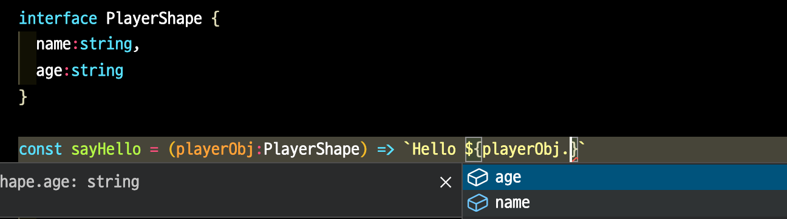
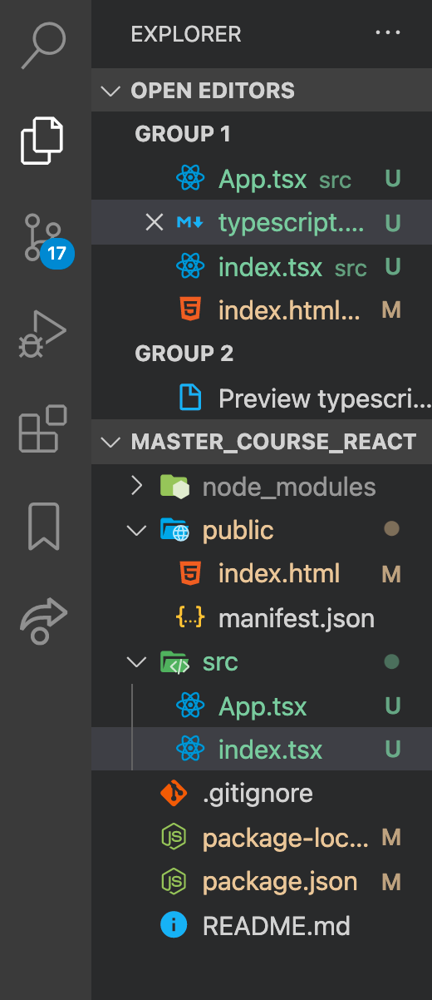

# Typescript

## Typescript란?   
- Typescript란 Javascript를 기반으로 한 프로그래밍 언어다.    
2012년 마이크로소프트사가 발표한 타입스크립트는 자바스크립트를 기반으로 정적 타입 문법이라는 기존의 자바스크립트에는 없던 새로운 문법을 추가한 프로그래밍 언어이다.         
~~그래서 자바스크립트를 거의 카피한 것인데, 다만 거기에다 새로운 기능만 살짝 추가한 언어라고 보면 된다.        
즉, 문법이 모두 같다 apart from sth new!~~ 
- 타입스크립트는 자바스크립트와 다른게 `strongly-typed` 언어다.     
어떤 언어가 `strongly-typed`하다는 의미는 **프로그래밍 언어가 작동하기 전에 type을 확인한다**는 말이다.       
e.g.     
```js 
  // 자바스크립트는 동작 전에 데이터 타입을 확인하지 않는다 
  const plus = (a, b) => a + b;

  plus(2, 2);      // 4
  plus(2, "hi");   // "2hi"

  // 이럴 경우 우리가 parameter b는 언제나 number 타입의 데이터야! 라고 지정하고 싶다하면 ... 
  // 결론만 얘기하자면, 자바스크립트는 그렇게 할 수 있는 방법이 없다! strongly-typed한 언어가 아니기 때문
  // 그래서 동작전에 type을 확인하고 싶으면 우리는 타입스크립트를 사용한다. 

  // 또는 another example.. 
  const user = {
    firstName: "Angela",
    lastName: "Davis",
    role: "Professor"
  };    

  console.log(user.name);    // undefined 
  // 원래 출력하고 싶은거는 user.firstName 이었지만 만약 우리가 user.name을 출력해달라고 해도 자바스크립트는 우리들의 "실수"를 잡아주지 않는다.   
  // 만약 이런 경우에서 에러가 나기전에/동작하기전에 뭔가가 잘못됐다고 잡아주길 원한다면 타입스크립트를 사용하면 된다.
  // 타입스크립트의 경우 아래와 같은 에러를 발생시켜준다 
  // Property 'name' does not exist on type '{firstName: string; lastName: string; role: string;}'.
```

<br />

> 타입스크립트의 특징 

>> 컴파일 언어, 정적 타입 언어 
- 자바스크립트는 동적 타입의 인터프리터 언어로 런타임에서 오류가 발견될 수 있다.    
이와 달리 타입스크립트는 **정적 타입의 컴파일 언어**이며 타입스크립트 컴파일러 또는 _바벨(Babel)_을 통해 자바스크립트 코드로 변환된다.      
코드 작성 단계에서 타입을 체크해 오류를 확인할 수 있고 미리 타입을 결정하기 때문에 실행 속도가 빠르다는 장점이 있다.    
하지만 코드 작성 시 매번 타입을 결정해야 하기 때문에 번거롭고 코드량이 증가하며 컴파일 시간이 오래 걸린다는 단점도 있다.   

>> 자바스크립트 슈퍼셋 (Superset)
- 타입스크립트는 자바스크립트의 슈퍼셋, 즉 자바스크립트 기본 문법에 타입스크립트의 새로운 문법이 추가된 형태의 언어이다.   
따라서 유효한 자바스크립트로 작성한 코드는 확장자를 `.js`에서 `.ts`로 변경하고 타입스크립트로 컴파일해 변환할 수 있다.  

>> 객체 지향 프로그래밍 지원 
- 타입스크립트는 ECMAScript 6에서 새롭게 사용된 문법을 포함하고 있으며 _클래스, 인터페이스, 상속, 모듈 등_과 같은 객체 지향 프로그래밍 패턴을 제공한다. 

<!-- <br />

> 타입스크립트를 사용하면 좋은 점 -->

<br />
<br />
<br />

## Typescript 기본문법 

<br />

> Typescript으로 데이터 타입 지정
- 타입스크립트는 다양한 기본 타입을 제공한다: 
  - `Boolean, Number, String, Object, Array, Tuple, Enum, Any, Void, Null, Undefined, Never`
- e.g.     
  ```js
    // js
    const plus = (a, b) => a + b;

    // ts
    const plus = (a:number, b:number) => a + b;

    plus(1, 1);     // 1
    plus("a", 2);   // 해당 코드는 작동하지 않는다 
  ```
- 다만, 브라우저가 이해하는 프로그래밍 언어는 자바스크립트다.    
그래서 우리가 편하게 타입스크립트로 필요한 코드를 작성한뒤, 이를 publish 해야할 때 compile해서 평범한 javascript로 만들어주면 되겠다.    

<br />

>> 변수에 타입 설정 
- e.g.     
  ```js
    // js
    let str = 'hi';
    let num = 100;

    let arr = [1, 2, 3];
    let arr 2= [4, 5, 6];

    let obj = {};
    let obj2 = {
      name: 'hyun',
      age: 25
    };


    // ts
    let str:string = 'hi';
    let num:number = 100;

    let arr:Array = [1, 2, 3];
    let arr2:number[] = [4, 5, 6];

    let obj:object = {};
    let obj2:{name:string, age:number} = {
      name: 'hyun',
      age: 25
    };
  ```

<br />

>> 함수에 타입 설정 
- e.g.     
  ```js
    // js
    function add(a, b) {
      return a + b;
    }

    // ts
    function add(a:number, b:number):number {
      return a + b;
    }

    plus(1, 1);     // 1
    plus("a", 2);   // 해당 코드는 작동하지 않는다 
  ```

<br />

>> 타입스크립트의 기본 타입 중 자바스크립트에 존재하지 않는 타입 
- **Tuple**:     
배열의 타입 순서와 배열 길이를 지정할 수 있는 타입.    
- **Enum**:       
Number 또는 String 값 집합에 고정된 이름을 부여할 수 있는 타입.    
값의 종류가 일정한 범위로 정해져 있는 경우에 유용하다.     
기본적으로 0부터 시작하며 값을 1씩 증가한다.    
- **Any**:     
모든 데이터를 허용
- **Void**:      
변수에는 undefined와 null 만 할당하고 함수에는 리턴 값을 설정할 수 없는 타입
- **Never**:     
특정 값이 절대 발생할 수 없을 때 사용

<br />

> 타입스크립트에만 있는 문법/기능들 

>> 인터페이스 
- 인터페이스는 타입을 정의한 규칙을 의미한다 
- ~~다시 ...~~         
타입스크립트에서 인터페이스틑 객체의 스펙(속성과 속성의 타입), 함수의 파라미터, 함수의 스펙(파라미터, 반환 타입 등), 배열과 객체를 접근하는 방식, 클랙스 등에서 "약속"을 정의할 수 있는 문법이다.        
  - e.g.        
  ```js 
    interface PlayerShape {
      name:string, 
      age:number 
    }

    const sayHello = (playerObj:PlayerShape) => `Hello ${playerObj.age} years old.`  
    // -> 까지 쳐보면 옵션이 두개가 나올 것. 그리고 그 옵션은 PlayerShape에서 "약속"한 대로 나올 것 아래의 그림과 같이 ...
    // 그리고 위의 interface로 정의해준 "약속"을 지키기만 한다면 function sayHello는 언제든 사용하는데 문제가 없을 것! 
  ```

  

<!-- https://joshua1988.github.io/ts/guide/interfaces.html#%EC%9D%B8%ED%84%B0%ED%8E%98%EC%9D%B4%EC%8A%A4
https://www.samsungsds.com/kr/insights/TypeScript.html -->

  
>> 오퍼레이터 

>> 제네릭 

>> 타입 추론 

>> 타입 단언 

>> 타입 호환 

<!-- https://www.samsungsds.com/kr/insights/TypeScript.html -->

<br />

>> Optional props 
- 방법 1:    
  ```js
    // e.g. 
    interface CircleProps {
      bgColor: string;
      borderColor?: string;     // -> : 앞에 ?를 붙이면 optional props가 된다
    }
  ``` 
- 방법 2: 
  ```js
    // e.g. 
    interface CircleProps {
      bgColor: string;
      borderColor: string | undefined;     // cf. 하지만 방법 1이 이것보다 짧음! 고려하기!
    }
  ``` 

<br />

>> 컴포넌트에 props 값이 없어도 적용될 기본값 지정하기  
- 타입스크립트 방법:        

  ```js
    // e.g. Circle.tsx

    import styled from "styled-components";

    // 인터페이스 - 명시적으로 함수의 인자의 형태/타입을 정의할 수 있다
    interface CircleProps {
      bgColor:string;
      borderColor?:string;
    }

    interface ContainerProps {
      bgColor:string;
      borderColor:string;
    } 

    const Container = styled.div<ContainerProps>`
      width: 200px;
      height: 200px;
      background-color: ${(props) => props.bgColor};
      border: 4px solid ${(props) => props.borderColor};
      border-radius: 100px;
    `;

    function Circle ( { bgColor, borderColor }:CircleProps ) {    
      return (
        <Container bgColor={bgColor} borderColor={borderColor ?? "violet"} />    // cf. 기본값 설정 -> ??은 null 병합 연산자와 관련 -> 좌항의 피연산자가 null 또는 undefined인 경우 우항의 피연산자를 반환하고, 그렇지 않으면 좌항의 피연산자를 반환한다.
      );
    }

    export default Circle;
  ``` 

- 자바스크립트 방법:        

  ```js
    // e.g. Circle.tsx

    import styled from "styled-components";

    // 인터페이스 - 명시적으로 함수의 인자의 형태/타입을 정의할 수 있다
    interface CircleProps {
      bgColor:string;
      borderColor?:string;
      text?:string;
    }

    interface ContainerProps {
      bgColor:string;
      borderColor:string;
    } 

    const Container = styled.div<ContainerProps>`
      width: 200px;
      height: 200px;
      background-color: ${(props) => props.bgColor};
      border: 4px solid ${(props) => props.borderColor};
      border-radius: 100px;
    `;

    function Circle ( { bgColor, borderColor, text = "default text" }:CircleProps ) {    
      return (
        <Container bgColor={bgColor} borderColor={borderColor ?? "violet"}>   
        // cf. 기본값 설정 -> ??은 null 병합 연산자와 관련 -> 좌항의 피연산자가 null 또는 undefined인 경우 우항의 피연산자를 반환하고, 그렇지 않으면 좌항의 피연산자를 반환한다.

          {text}
        </Container>    
      );
    }

    export default Circle;
  ``` 


<!--  -->


<br />
<br />
<br />

## 타입스크립트로 변환하는 방법 
- `npx create-react-app` 명령어로 리액트 어플리케이션 프로젝트 폴더를 만들어 줄 때, 뒤에 `--template typescript`를 붙여서 해당 리액트 앱에 타입스크립트가 함께 구성되어 있게 해준다.        
e.g.     
  ```
    $ npx create-react-app [어플리케이션 이름] --template typescript

    // TIP! 위의 명령어 후에 styled-components를 사용할 거면 설치해주면 됨! -> $ npm i styled-components
    // 만약 현재 이미 만들어져 있는 리액트 앱 폴더에 타입스크립트를 "추가"해주고 싶은 경우는 아래의 명령어를 terminal에 입력! 

    $ npm install --save typescript @types/node @types/react @types/react-dom @types/jest
  ```
- 그리고 나서 타입스크립트의 파일 확장자는 더이상 `.js`가 아닌 `.ts`이다.    
단, 타입스크립트를 리액트에서 사용할 때는 확장자를 `.tsx`로 사용한다.   
- e.g.     
   
- 여기서 잠깐!     
만약 원래 `App.js` 또는 `index.js` 파일을 확장자 `.tsx`로 바꾸면 타입스크립트는 "complaining" 할 것이다. 왜냐면 styled-components가 뭐고 props가 뭐고, 타입스크립트는 그런 것들을 모두 일일히 알아야하는 아이이기 때문이다.     
예를 들어, styled-components 같은 패키지를 타입스크립트가 뭔지 인지하지 못하는 이유는 패키지가 타입스크립트가 아닌 자바스크립트로 만들어졌기 때문이다. 
- 그래서 위와 같이 타입스크립트로 만들어지지 않은 라이브러리를 import 할 때, 타입스크립트가 "complaining" 하지 못하게 하는 방법/solution:          
  - `$ npm install @types/styled-components` 커맨드 실행 
  - 설명:      
  그러면 why this [@types](https://www.npmjs.com/package/@types/node) command so magical??      
  우선, `@types`란 아주 큰 Github repository인데, 여기에는 모든 유명한 npm 라이브러리를 갖고 있다.    
  그리고 여기서 (타입스크립트가 이해하지 못하는) 라이브러리나 패키지의 "type definition"을 사람들이 만들어서 올린 것이다.     
  여기서 말하는 "**type definition**"이란...     
  어떤 라이브러리나 패키지의 소스코드를 보고 타입스크립트가 이해할 수 있도록 타입스크립트에게 해 줄 설명을 만든 것을 뜻한다.       
  그래서 e.g. 원래는 타입스크립트가 styled-components가 뭐하는 아인지 모르는데, 이 @types에 있는 type definition 을 깔아주면 타입스크립트에게 styled-components가 무엇인지 설명을 해줬기 때문에 이제 타입스크립트는 "투덜대지 않고 할일을 하게 되는 것"이라고 이해하면 쉽다.    

<br />

> 타입스크립트랑 styled-components 테마를 연결하는 방법 (cf. 다크모드 & 라이트모드)
- 만약 styled-components가 아예 설치가 안되어있으면 명령어 `$ npm install @types/styled-components`
- 만약 styled-components가 설치가 완료되었으면, ~~create~~ a declarations file을 "보충"해 준다.     
이때, 확장자는 e.g. `styled.d.ts` (declarations file)이다.    
우리는 이미 이 파일을 다운로드 받은 상황이지만, 타입스크립트와 styled-components는 이미 갖고 있는 파일로도 ok.    
하지만 우리는 이제 theme을 사용할 거니까 조금 더 "확장"할 필요가 있다.    
그럼 이제 어떻게 declaration(cf. 선언) 파일을 만드는지 알아보자!     
[참고 링크](https://styled-components.com/docs/api#typescript)     
- steps:    
  - 1. `src` 디렉토리로 가서 `styled.d.ts`라는 파일을 생성한다.      
  이 파일을 일종의 우리가 이전에 설치해 놓은 파일을 override(덮어쓰기)할 것이다.    
  - 2. [참고 링크](https://styled-components.com/docs/api#typescript)에 가서 아래 코드를 copy & paste한다.    

  ```js
    // import original module declarations
    import 'styled-components';

    // and extend them!
    declare module 'styled-components' {
      export interface DefaultTheme {
        borderRadius: string;

        colors: {
          main: string;
          secondary: string;
        };
      }
    }
  ```
  - 3. 위의 `interface` 안에 들어가는 내용이 어떤 theme으로 보여질 것에 대한 내용인데, 우리가 원하는데로 수정한다.    
    ```js
    // import original module declarations
    import 'styled-components';

    // and extend them!
    declare module 'styled-components' {
      export interface DefaultTheme {
        borderRadius: string;

        colors: {
          main: string;
          secondary: string;
        };
      }
    }
  ```


<!--  -->


<br />
<br />

---
<details>
<summary>CLICK ME!</summary>

  - cf. 
    - https://www.samsungsds.com/kr/insights/TypeScript.html
    - https://www.merriam-webster.com/dictionary/typescript
    - https://www.geeksforgeeks.org/difference-between-typescript-and-javascript/
    - https://www.spec-india.com/blog/typescript-vs-javascript

    - https://insights.stackoverflow.com/survey/2020#technology-most-loved-dreaded-and-wanted-languages-loved
    - https://www.Typescriptlang.org/
    - https://github.com/microsoft/Typescript/wiki/Performance
    - https://v3.vuejs-korea.org/guide/Typescript-support.html
    - https://ko.reactjs.org/docs/static-type-checking.html#Typescript
    - https://serokell.io/blog/why-Typescript
    - https://www.twilio.com/blog/move-to-Typescript#ts-compiler-for-js
    - https://www.inflearn.com/course/타입스크립트-입문#
    - http://it.chosun.com/site/data/html_dir/2018/07/24/2018072402352.html


</details>

---